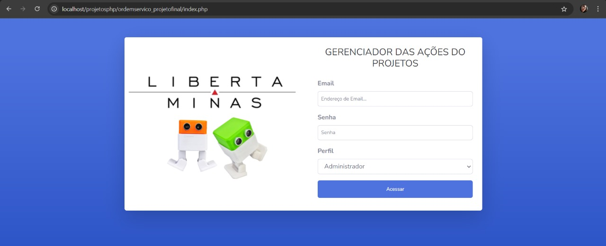
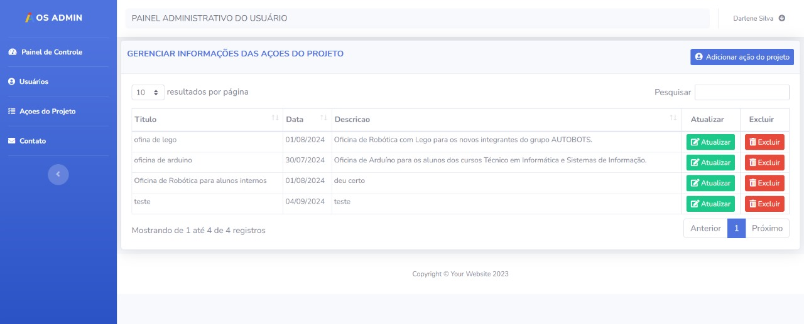
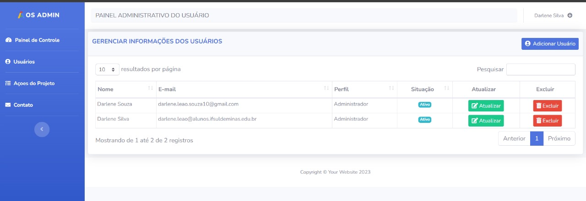
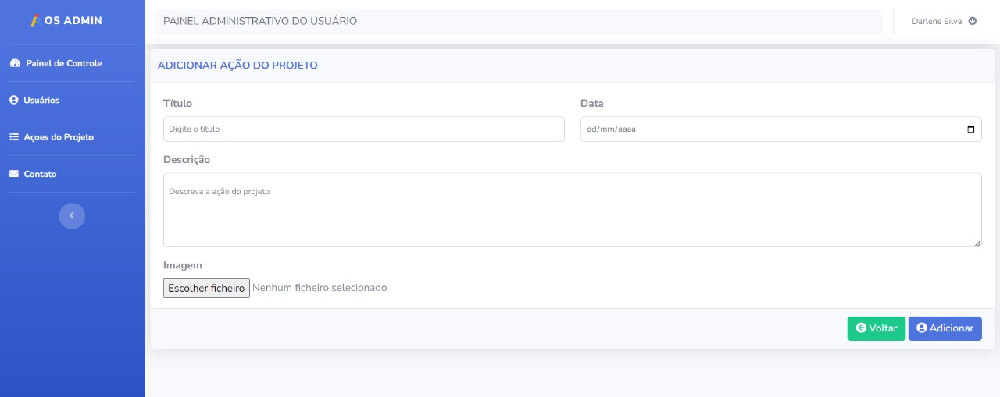
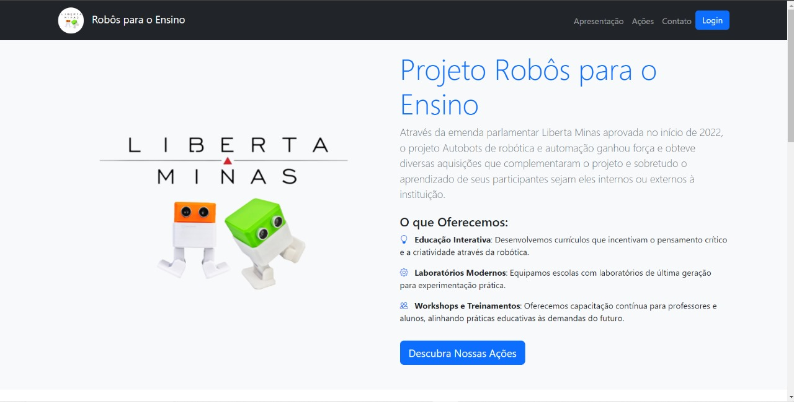
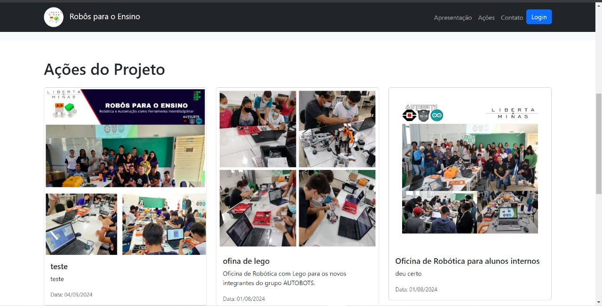

# Ordem de Serviço - Robôs para Ensino

Este projeto é um sistema web desenvolvido para gerenciar ordens de serviço relacionadas a robôs educacionais. Ele permite o cadastro e acompanhamento de ações, usuários e projetos, visando otimizar a organização e manutenção de robôs utilizados em ambientes educacionais.

## 📌 Funcionalidades

- **Cadastro de usuários:** Permite o registro de novos usuários no sistema.
- **Gerenciamento de ações:** Possibilita o cadastro, edição e exclusão de ações relacionadas às ordens de serviço.
- **Envio de e-mails:** Utiliza o PHPMailer para envio de notificações por e-mail.
- **Interface amigável:** Desenvolvida com HTML, CSS e SCSS para uma melhor experiência do usuário.
- **Banco de dados:** Estruturação e manipulação de dados utilizando phpMyAdmin.

## 🛠️ Tecnologias Utilizadas

- **Frontend:** HTML, CSS, SCSS, JavaScript
- **Backend:** PHP
- **Banco de Dados:** phpMyAdmin
- **Bibliotecas:** PHPMailer

## 📷 Capturas de Tela

### Página de Autenticação

### Página de Gerenciamento

### Página de Gerenciamento de Usuários

### Página de Adicionar Projeto

### Página de Apresentação

### Página de Apresentação de Oficinas

